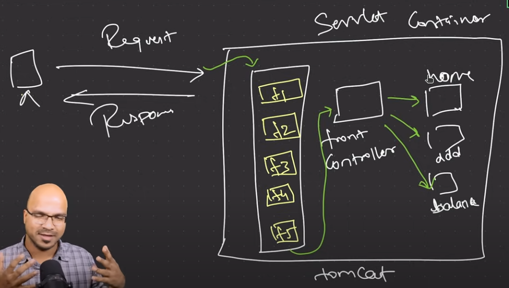
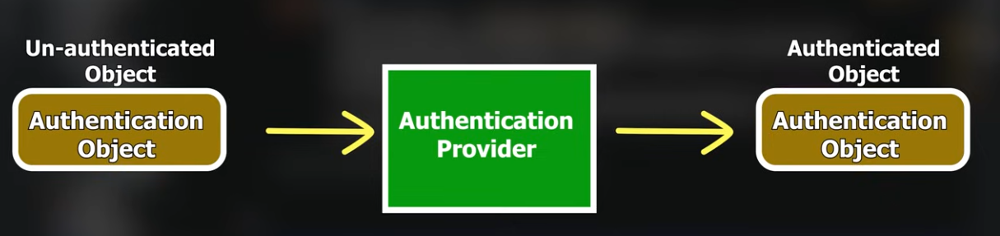

# Spring Security Configuration Guide
\* Head over to **# Summary**, if only revision needed!
## Overview
Spring Security is a powerful framework for implementing authentication, authorization, and protection against common security vulnerabilities in Spring Boot applications.

## 1. Adding Spring Security Dependency

Add the following dependency to your `pom.xml`:

```xml
<dependency>
    <groupId>org.springframework.boot</groupId>
    <artifactId>spring-boot-starter-security</artifactId>
</dependency>
```

## 2. Default Behavior and Key Characteristics



### Authentication
- Default login credentials:
  - Username: `user`
  - Password: Auto-generated and printed in console
- Session management is built-in
- Cannot open the same API in a new browser simultaneously

### Configuration Tips
- Use `spring.security.user.name` and `spring.security.user.password` to configure default credentials
- CSRF (Cross-Site Request Forgery) protection is enabled by default

## 3. CSRF Token Handling

### Retrieving CSRF Token
```java
@GetMapping("/csrf-token")
public CsrfToken getCsrfToken(HttpServletRequest request){
    return (CsrfToken) request.getAttribute("_csrf");
}
```

### Sending CSRF Token in Postman
- Add header: `X-CSRF-TOKEN: <token-value>`

## 4. Configuring Security Filter Chain

### Basic Configuration
```java
@Configuration
@EnableWebSecurity
public class SecurityFilter {
    @Bean
    public SecurityFilterChain securityFilterChain(HttpSecurity httpSecurity) throws Exception {
        return httpSecurity
            .csrf(customizer -> customizer.disable())
            .authorizeHttpRequests(request -> request.anyRequest().authenticated())
            .httpBasic(Customizer.withDefaults())
            .sessionManagement(session -> 
                session.sessionCreationPolicy(SessionCreationPolicy.STATELESS))
            .build();
    }
}
```

### Key Configuration Options
- `.csrf(customizer -> customizer.disable())`: Disable CSRF protection
- `.authorizeHttpRequests()`: Configure request authorization
- `.httpBasic()`: Enable basic authentication
- `.sessionManagement()`: Control session creation policy

## 5. User Authentication Configuration

### UserDetailsService Implementation
```java
@Bean
public UserDetailsService userDetailsService() {
    UserDetails user1 = User.withDefaultPasswordEncoder()
        .username("utkarsh")
        .password("1234")
        .build();
    UserDetails user2 = User.withDefaultPasswordEncoder()
        .username("hola")
        .password("123")
        .build();
    return new InMemoryUserDetailsManager(user1, user2);
}
```

> **Note:** `withDefaultPasswordEncoder()` is deprecated. In production, use more secure password encoding.

## 6. Authentication Flow



1. **Login Request**: Client sends username and password
2. **UsernamePasswordAuthenticationFilter**: Creates authentication token
3. **AuthenticationManager**: Delegates to AuthenticationProvider
4. **AuthenticationProvider**: 
   - Loads user details via UserDetailsService
   - Validates credentials
5. **Result**:
   - Success: Authenticated object stored in SecurityContext
   - Failure: Authentication exception thrown

## 7. Custom Authentication Provider

```java
@Bean
public AuthenticationProvider authenticationProvider() {
    DaoAuthenticationProvider authProvider = new DaoAuthenticationProvider();
    authProvider.setPasswordEncoder(NoOpPasswordEncoder.getInstance());
    authProvider.setUserDetailsService(userDetailsAuthService);
    return authProvider;
}
```


## 8. What is @Bean?

`@Bean` is an annotation in the Spring Framework used to indicate that a method produces a bean to be managed by the Spring container. Key characteristics include:

- Used in classes annotated with `@Configuration`
- Allows the Spring IoC (Inversion of Control) container to manage the bean
- Provides a way to define beans programmatically
- Offers fine-grained control over bean creation and configuration

### Detailed Explanation of @Bean

When a method is annotated with `@Bean`:
- The method's return type becomes a bean managed by the Spring container
- Spring will manage the lifecycle of the bean
- You can customize bean creation, including initialization and destruction methods
- Useful for creating beans from third-party libraries or complex configurations

## 9. @Bean vs @Component

| Aspect       | @Bean                                      | @Component                                      |
|--------------|--------------------------------------------|-------------------------------------------------|
| Definition   | Declares a bean explicitly in @Configuration | Registers a class as a bean automatically     |
| Detection    | Manual method-level definition             | Auto-detected via classpath scanning            |
| Customization| Provides fine-grained configuration        | Limited to default behavior                     |
| Use Case     | Complex/third-party library initialization | Simple, self-contained components               |

## Best Practices
- Always use strong password encoding
- Implement proper authorization rules
- Be cautious when disabling CSRF protection
- Consider stateless authentication for microservices


## Summary
It's all about 3 interfaces:
### 1. SecurityFilterChain
- Defines the sequence of filters, that will process the incoming request.
- It is configured using HttpSecurity object to play with the filters.
- Can be used to override CSRF, SessionManagement behavior, etc.
- One of the filters **UsernamePasswordAuthenticationFilter**, initiates the Authentication process.
- The UsernamePasswordAuthenticationFilter delegates authentication to **AuthenticationManager**, which uses AuthenticatioProvider for the actual authentication.

### 2. AuthenticationProvider
- It performs the actual work of authentication, by validating the user credentials.
- Uses the UserDetailsService to fetch user details and then does the password matching, etc.
- The primary method is:
    ```java
    Authentication authenticate(Authentication authentication) throws AuthenticationException;
    ```

### 3. UserDetailsService
- It fetches the User details from data sources (e.g., databases).
- Primary method is:
    ```java
    UserDetails loadUserByUsername(String username) throws UsernameNotFoundException;
    ```
- **UserDetails** is also an interface, will have to create an implementing class.